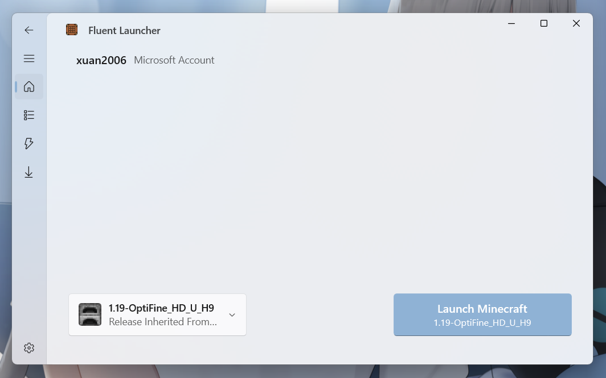

# Natsurainko.FluentLauncher

<!-- PROJECT SHIELDS -->

[![Contributors][contributors-shield]][contributors-url]
[![Forks][forks-shield]][forks-url]
[![Stargazers][stars-shield]][stars-url]
[![Issues][issues-shield]][issues-url]
[![MIT License][license-shield]][license-url]

<!-- PROJECT LOGO -->
 

  

  <h3 align="center">Natsurainko.FluentLauncher</h3>
  

    基于 WinUI 3 的 Minecraft: Java Edition 启动器
     
    

      简体中文 |
      <a href="https://github.com/Xcube-Studio/Natsurainko.FluentLauncher/docs/README_EN.md">English</a>
    

    

      <a href="https://github.com/Xcube-Studio/Natsurainko.FluentLauncher">开发文档</a>
      ·
      <a href="https://github.com/Xcube-Studio/Natsurainko.FluentLauncher/releases">查看发行版</a>
      ·
      <a href="https://github.com/Xcube-Studio/Natsurainko.FluentLauncher/issues">报告Bug</a>
      ·
      <a href="https://github.com/Xcube-Studio/Natsurainko.FluentLauncher/issues">提出新特性</a>
    

  

## 目录

- [上手指南](#上手指南)
  - [运行前的配置要求](#运行前的配置要求)
  - [安装方式](#安装方式)
- [源代码部署](#源代码部署)
- [贡献者](#贡献者)
  - [如何参与开源项目](#如何参与开源项目)
- [版本控制](#版本控制)
- [作者](#作者)
- [鸣谢](#鸣谢)

### 上手指南
  
1. 安装运行
2. 在设置页面对启动器进行初步的配置 如游戏目录的选取 Java 运行时的添加 游戏帐户的添加
    + 后续计划更新: 在第一次运行启动器时显示启动器配置向导
3. 开始食用

###### 运行前的配置要求
+ **在微软商店中安装应用可以跳过此项** (需要验证

1. Windows 10.0.19041.0 及以上系统版本
    + WinUI 3 最低支持 Windows 10.0.17763.0 (所以理论上可以调低版本限制 但是目前看来还不必要
2. [net6.0 运行时](https://dotnet.microsoft.com/zh-cn/download/dotnet/6.0)
3. [WindowsAppSDK 1.2 运行时](https://learn.microsoft.com/zh-cn/windows/apps/windows-app-sdk/downloads)
4. [WebView2 运行时](https://developer.microsoft.com/zh-cn/microsoft-edge/webview2/consumer/)
    + 如果你的电脑上 已经有默认安装的 基于 Chromium 的 Edge 则你不需要安装此项 (需要验证

###### **安装方式**

+ [在 Microsoft Store 中获取 Natsurainko.FluentLauncher](https://apps.microsoft.com/store/detail/natsuriankofluentlauncher/9p4nqqxq942p?hl=zh-cn&gl=cn)  
 
+ 或安装 [Release](https://github.com/Xcube-Studio/Natsurainko.FluentLauncher/releases) 中的 Msixbundle 安装包
    + [如何安装 Msixbundle 包 ?](https://github.com/Xcube-Studio/Natsurainko.FluentLauncher/wiki/%E5%A6%82%E4%BD%95%E5%AE%89%E8%A3%85-Msixbundle-%E5%8C%85)

### 源代码部署
+ **此项面向开发人员**
+ **首先确保你的电脑上以及安装好了 Visual Studio 2022**
+ **并且以及安装好了 .NET 6 SDK、Windows 11 SDK、WindowsAppSDK 等开发所需要的环境**

+ 从源代码仓库部署
  1. 克隆本项目、[Natsurainko.FluentCore](https://github.com/Xcube-Studio/Natsurainko.FluentCore)、[Natsurainko.Toolkits](https://github.com/natsurainko/Natsurainko.Toolkits) 到同一文件夹中。 
  2. 使用 Release x64 配置运行项目 

+ 直接向作者要一份已经合并好的项目源代码文件
  > 这样子能够避免引用项目文件版本对不上的问题, 但作者在线时间较少

### 贡献者

查看更多关于这个项目的贡献者，请阅读 [contributors](https://github.com/Xcube-Studio/Natsurainko.FluentLauncher/graphs/contributors) 

#### 如何参与开源项目

贡献使开源社区成为一个学习、激励和创造的绝佳场所。你所作的任何贡献都是**非常感谢**的。

1. 点击右上角`Fork`，再点击下方`Create fork`创建一份本仓库的分支
2. 创建你的内容分支：`git checkout -b feature/[your-feature]`
3. 提交你的更改：`git commit -m '[描述你的更改]'`
4. 将更改推送至远程分支：`git push origin feature/[your-feature]`
5. 创建拉取请求

### 版本控制

该项目使用Git进行版本管理。您可以在 repository 参看当前可用版本。

### 作者

* **natsurainko** - *启动核心 启动器*
* **xingxing520** - *服务 网络服务部署*

> natsurainko a-275@qq.com  
> qq group:1138713376

*您也可以在贡献者名单中参看所有参与该项目的开发者。*

### 版权说明

该项目签署了MIT 授权许可，详情请参阅 [LICENSE](LICENSE)  
Copyright (c) 2022-2023 Xcube Studio

### 鸣谢

- [Best_README_template 模板](https://github.com/shaojintian/Best_README_template)
- [bmclapi 下载源](https://bmclapidoc.bangbang93.com/)
- [mcbbs 下载源](https://download.mcbbs.net)
- [Cloudflare CDN](https://www.cloudflare.com)

<!-- links -->
[your-project-path]:Xcube-Studio/Natsurainko.FluentLauncher
[contributors-shield]: https://img.shields.io/github/contributors/Xcube-Studio/Natsurainko.FluentLauncher.svg?style=flat-square
[contributors-url]: https://github.com/Xcube-Studio/Natsurainko.FluentLauncher/graphs/contributors
[forks-shield]: https://img.shields.io/github/forks/Xcube-Studio/Natsurainko.FluentLauncher.svg?style=flat-square
[forks-url]: https://github.com/Xcube-Studio/Natsurainko.FluentLauncher/network/members
[stars-shield]: https://img.shields.io/github/stars/Xcube-Studio/Natsurainko.FluentLauncher.svg?style=flat-square
[stars-url]: https://github.com/Xcube-Studio/Natsurainko.FluentLauncher/stargazers
[issues-shield]: https://img.shields.io/github/issues/Xcube-Studio/Natsurainko.FluentLauncher.svg?style=flat-square
[issues-url]: https://img.shields.io/github/issues/Xcube-Studio/Natsurainko.FluentLauncher.svg
[license-shield]: https://img.shields.io/github/license/Xcube-Studio/Natsurainko.FluentLauncher.svg?style=flat-square
[license-url]: https://github.com/Xcube-Studio/Natsurainko.FluentLauncher/blob/master/LICENSE.txt
