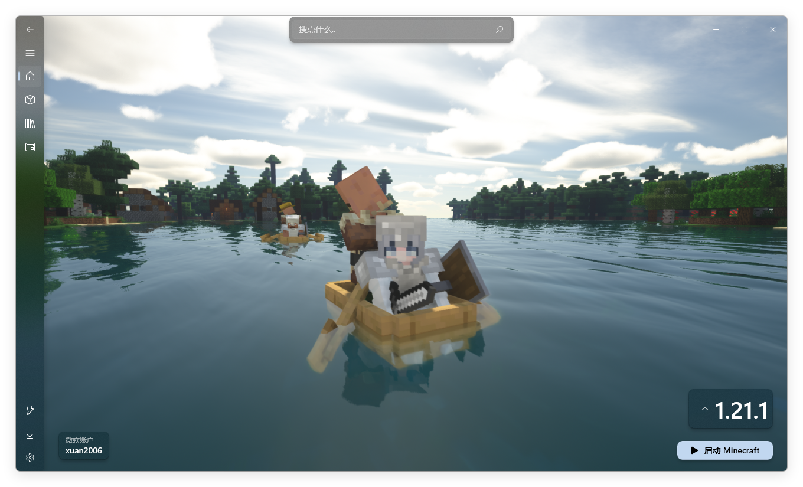

#  Fluent Launcher

基于 .NET 8 以及 WinUI3 技术开发的 Minecraft Java 版启动器  
专为 Windows 11 设计的 Minecraft 启动器  
提供简洁、流畅的视觉体验

### [英文版 README 文档 / English README document](https://github.com/Xcube-Studio/Natsurainko.FluentLauncher/blob/main/docs/README_EN.md)

## 窗口截图 🪟

## 未来路线计划 📝

| 功能                                     | 状态               |
| ---------------------------------------- | ------------------ |
| NativeAOT 支持                            | 进行中 [ ] |
| 分 Stable、Preview、Dev 通道分发           | 进行中 [ ] |
| 升级到 CommunityToolkit 8.1               | Blocked by MarkdownTextBlock [ ] |
| Little Skin 的 OAuth 支持                 | [ ] |
| 游戏整合包导入                             | [ ] |

## 功能列表 ✨

+ 基本功能
  + [x] 管理 .minecraft 中的游戏核心、安装游戏核心
  + [x] 特定游戏核心设置、版本隔离设置
  + [x] 管理特定游戏核心的模组
  + [x] 创建、启动、管理 Minecraft 进程 
  + [x] 多线程高速补全游戏资源
  + [x] 查找已安装的 Java 运行时
  + [x] 任务栏快速启动游戏
  + [x] 支持第三方下载镜像源 [Bmclapi、Mcbbs](https://bmclapidoc.bangbang93.com/)
+ 多种验证方案的支持
  + [x] 微软验证
  + [x] Yggdrasil 验证 (外置验证)
  + [x] 离线验证
  + [ ] 统一通行证验证 (`需要讨论?`)
+ 多种加载器安装器的支持
  + [x] Forge 安装器 (NeoForge 暂用)
  + [x] Fabric 安装器
  + [x] OptiFine 安装器
  + [x] Quilt 安装器
  + [ ] LiteLoder (`已过时而未支持`)
+ 第三方资源下载的支持
  + [x] 下载 CurseForge 上的资源
  + [x] 下载 Modrinth 上的资源

## 应用分发 ✈️

#### *一定需要安装才能运行应用 [.NET 8 运行时](https://dotnet.microsoft.com/zh-cn/download/dotnet/8.0) (不论是从哪种通道安装)*

### *稳定版通道 (Stable)*

+ 从 Microsoft Store 安装  

+ 手动安装 Releases 中的 msixbundle 包 
  + [如何安装 Msixbundle 包?](https://github.com/Xcube-Studio/Natsurainko.FluentLauncher/wiki/%E5%A6%82%E4%BD%95%E5%AE%89%E8%A3%85-Msixbundle-%E5%8C%85)

### *预览版通道 (Preview)*

+ 下载 [FluentLauncher.PreviewChannel.PackageInstaller](https://github.com/Xcube-Studio/FluentLauncher.PreviewChannel.PackageInstaller/releases/tag/v0.0.2) 以及 Releases 中的 Preview 更新包 (如 `updatePackage-x64.zip` 文件) **(请下载适合自己系统架构的文件)**
+ 将两者放在同一目录下
+ 运行 FluentLauncher.PreviewChannel.PackageInstaller 即可

*预览版通道支持应用自更新，可以在 `设置-关于` 页面检查更新*

### *开发板通道 (Dev)*

克隆本仓库，从源码手动编译程序  
编译详见 [如何编译源代码](#如何编译源代码)

## 开发事宜 🔧

### 如何编译源代码

编译前提：
> + 安装 .NET 桌面开发的 Visual Studio 2022
> + 安装 [.NET SDK](https://dotnet.microsoft.com/en-us/download/visual-studio-sdks) 的开发工具
> + 安装 [WindowsAppSDK](https://learn.microsoft.com/en-us/windows/apps/windows-app-sdk/set-up-your-development-environment?tabs=cs-vs-community%2Ccpp-vs-community%2Cvs-2022-17-1-a%2Cvs-2022-17-1-b) 的开发环境和 [Visual Studio 扩展](https://learn.microsoft.com/en-us/windows/apps/windows-app-sdk/single-project-msix?tabs=csharp)

准备好上述环境后

1. 克隆 GitHub 仓库及其子模块
2. 确保代码完整后，在本地用 Visual Studio 打开
3. 在 Nuget 包管理器中添加 CommunityToolkit-Labs 的 Nuget 包源  
https://pkgs.dev.azure.com/dotnet/CommunityToolkit/_packaging/CommunityToolkit-Labs/nuget/v3/index.json (升级到 CommunityToolkit 8.0 后将不需要)  
4. F5 编译运行

### 本地化调试开发

`本地化脚本目前有所改动，暂时先不列出`

#### 贡献本地化资源
详细见仓库 **[Xcube-Studio/FluentLauncher.Localization](https://github.com/Xcube-Studio/FluentLauncher.Localization)**

### 如何贡献该项目

1. 点击右上角 `Fork` ，再点击下方 `Create fork` 创建一份本仓库的分支
2. 创建你的内容分支：`git checkout -b feature/[your-feature]`
3. 提交你的更改：`git commit -m '[描述你的更改]'`
4. 将更改推送至远程分支：`git push origin feature/[your-feature]`
5. 创建拉取请求

## 主要贡献者 🧑‍💻

* **natsurainko** - *启动核心 启动器*
* **gavinY** - *启动器后端架构、启动核心*
* **xingxing520** - *启动器发布 微软商店服务*
等其他贡献者与参与测试人员

*您也可以在贡献者名单中参看所有参与该项目的开发者。*

## 与我们联系 ☕️

Xcube Studio 开发群(qq): 1138713376  
Natsurainko 的邮箱: a-275@qq.com  

如果有任何项目代码的问题还是建议留 issues，各位贡献者都比较忙碌，不太有时间回复私信之类的

## 引用及鸣谢 🎉

#### 引用
+ 本篇 readme 模板引用自 [readme-template](https://github.com/iuricode/readme-template)  

#### 鸣谢
+ 首先感谢各位贡献者的共同努力  
+ 感谢 bangbang93 以及 mcbbs 提供镜像站服务 如果支持他们的服务话 可以[赞助Bmclapi](https://afdian.net/@bangbang93)  
+ 感谢 [Cloudflare CDN](https://www.cloudflare.com) 提供的云服务

## 版权

该项目签署了MIT 授权许可，详情请参阅 [LICENSE](LICENSE)  
Copyright (c) 2022-2024 Xcube Studio
