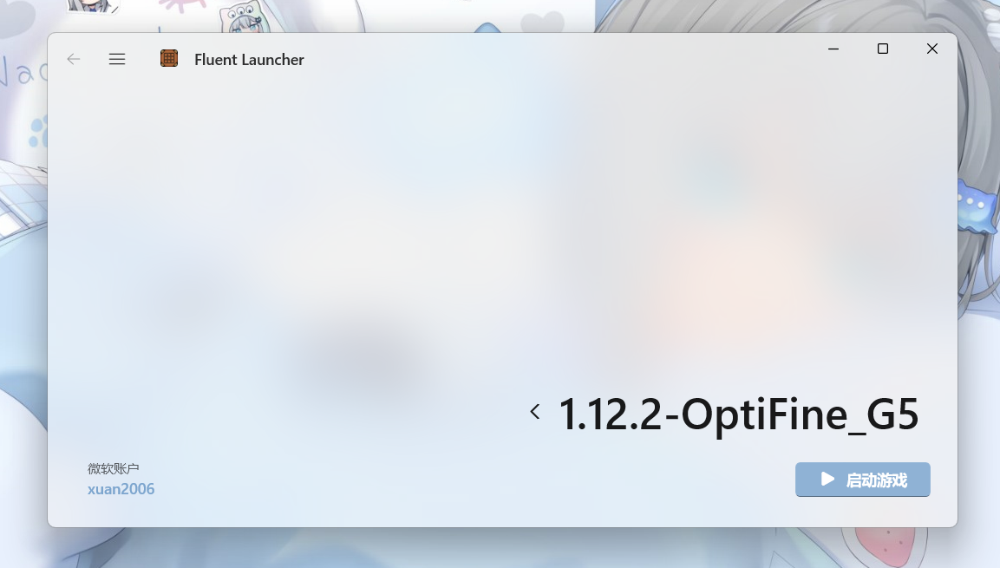

# Natsurainko.FluentLauncher

<!-- PROJECT SHIELDS -->

[![Contributors][contributors-shield]][contributors-url]
[![Forks][forks-shield]][forks-url]
[![Stargazers][stars-shield]][stars-url]
[![Issues][issues-shield]][issues-url]
[![MIT License][license-shield]][license-url]

<!-- PROJECT LOGO -->
 

  

  <h3 align="center">Natsurainko.FluentLauncher</h3>
  

    基于 WinUI 3 的 Minecraft: Java Edition 启动器
     
    

      简体中文 | English（暂无）
    

    

      <a href="https://github.com/Xcube-Studio/Natsurainko.FluentLauncher/releases">查看发行版</a>
      ·
      <a href="https://github.com/Xcube-Studio/Natsurainko.FluentLauncher/issues">报告Bug</a>
      ·
      <a href="https://github.com/Xcube-Studio/Natsurainko.FluentLauncher/issues">提出新特性</a>
    

  

## 目录
- [简介](#简介)
  - [如何安装](#如何安装)
  - [如何使用](#如何使用)
- [开发相关](#开发相关)
  - [如何编译源代码](#如何编译源代码)
  - [如何贡献该项目](#如何贡献该项目)
- [贡献者](#贡献者)
  - [联系开发者](#联系开发者)
- [鸣谢](#鸣谢)

### 简介

**这是一款完全基于 WinUI3 技术开的一款 Fluent Design 的 Minecraft 启动器  
我们的设计目标在于简洁、流畅的视觉体验**

  

----------------------
#### 如何安装

+ 我们推荐你直接从 Microsoft Store 直接安装我们的应用，这应该是最省事的办法（但是可能存在更新不及时的问题）
 
+ 从我们的提交的自动构建（Action）里面下载最近一次的 Build 的 msixbundle 安装包进行手动安装 
  + [如何安装 Msixbundle 包 ?](https://github.com/Xcube-Studio/Natsurainko.FluentLauncher/wiki/%E5%A6%82%E4%BD%95%E5%AE%89%E8%A3%85-Msixbundle-%E5%8C%85)
+ 你可以 clone 这个仓库，从源码手动编译程序

#### 如何使用

> 安装完后，第一次使用程序时会提供一个配置向导，来帮助你完成基础启动器配置，其他的高级设置需要你在设置中手动设置  
> 剩下的你只需要像别的启动器一样操作就行

### 开发相关

#### 如何编译源代码

_编译前提：_
+ 安装好 .NET 7 SDK 的开发工具
+ 已经安装好 .NET 桌面开发的 Visual Studio 2022
+ 已经安装好 WindowsAppSDK 1.3 的开发环境和 VS 扩展

准备好上述环境后

1. clone 该仓库然后在本地用 Visual Studio 打开
2. 在 Nuget 包管理器中添加 CommunityToolkit-Labs 的 Nuget 包源  
https://pkgs.dev.azure.com/dotnet/CommunityToolkit/_packaging/CommunityToolkit-Labs/nuget/v3/index.json
3. F5 编译运行

#### 如何贡献该项目

1. 点击右上角 `Fork` ，再点击下方 `Create fork` 创建一份本仓库的分支
2. 创建你的内容分支：`git checkout -b feature/[your-feature]`
3. 提交你的更改：`git commit -m '[描述你的更改]'`
4. 将更改推送至远程分支：`git push origin feature/[your-feature]`
5. 创建拉取请求

#### 如何贡献本地化资源

详细见仓库 **[Xcube-Studio/FluentLauncher.LocalizationPoroject](https://github.com/Xcube-Studio/FluentLauncher.LocalizationPoroject)**

### 版本控制

该项目使用Git进行版本管理。您可以在 repository 参看当前可用版本。

### 贡献者

* **natsurainko** - *启动核心 启动器*
* **gavinY** - *启动器 后端架构*
* **xingxing520** - *启动器发布 微软商店服务*

等其他贡献者与参与测试人员

*您也可以在贡献者名单中参看所有参与该项目的开发者。*

#### 联系开发者

> natsurainko a-275@qq.com  
> Xcube Studio qq群:1138713376

### 版权说明

该项目签署了MIT 授权许可，详情请参阅 [LICENSE](LICENSE)  
Copyright (c) 2022-2023 Xcube Studio

### 鸣谢

- [Best_README_template 模板](https://github.com/shaojintian/Best_README_template)
- [bmclapi 下载源](https://bmclapidoc.bangbang93.com/)
- [mcbbs 下载源](https://download.mcbbs.net)
- [Cloudflare CDN](https://www.cloudflare.com)

## 这里是一只猫猫

    

<!-- links -->
[your-project-path]:Xcube-Studio/Natsurainko.FluentLauncher
[contributors-shield]: https://img.shields.io/github/contributors/Xcube-Studio/Natsurainko.FluentLauncher.svg?style=flat-square
[contributors-url]: https://github.com/Xcube-Studio/Natsurainko.FluentLauncher/graphs/contributors
[forks-shield]: https://img.shields.io/github/forks/Xcube-Studio/Natsurainko.FluentLauncher.svg?style=flat-square
[forks-url]: https://github.com/Xcube-Studio/Natsurainko.FluentLauncher/network/members
[stars-shield]: https://img.shields.io/github/stars/Xcube-Studio/Natsurainko.FluentLauncher.svg?style=flat-square
[stars-url]: https://github.com/Xcube-Studio/Natsurainko.FluentLauncher/stargazers
[issues-shield]: https://img.shields.io/github/issues/Xcube-Studio/Natsurainko.FluentLauncher.svg?style=flat-square
[issues-url]: https://img.shields.io/github/issues/Xcube-Studio/Natsurainko.FluentLauncher.svg
[license-shield]: https://img.shields.io/github/license/Xcube-Studio/Natsurainko.FluentLauncher.svg?style=flat-square
[license-url]: https://github.com/Xcube-Studio/Natsurainko.FluentLauncher/blob/master/LICENSE.txt
