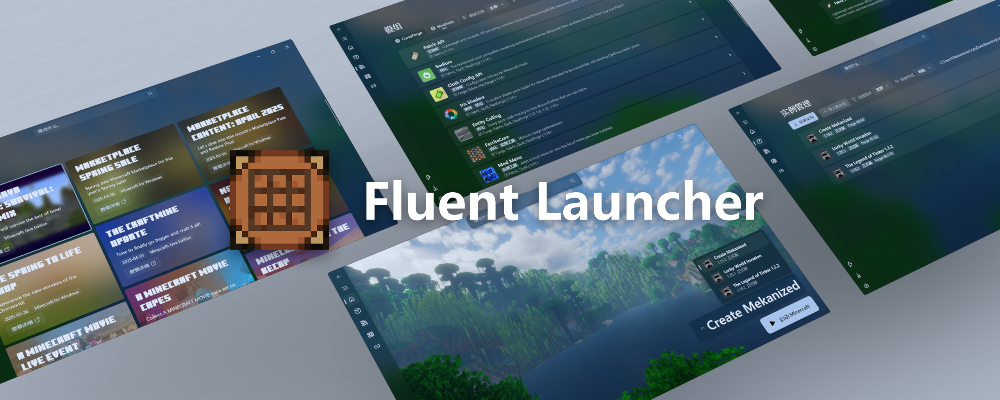

#### Ein Minecraft-Launcher, speziell für Windows 11 entwickelt, mit einer klaren und flüssigen visuellen Erfahrung
#### 🏪 [Microsoft Store Installation](https://apps.microsoft.com/detail/Natsurianko.FluentLauncher/9p4nqqxq942p) | ⬇️ [Preview-Kanal Installation](https://github.com/Xcube-Studio/FluentLauncher.Preview.Installer) | 🔧 [Entwicklungsdokumentation](https://github.com/Xcube-Studio/Natsurainko.FluentLauncher/wiki/%23-%E5%BC%80%E5%8F%91) | 🚧 [Roadmap](https://github.com/Xcube-Studio/Natsurainko.FluentLauncher/wiki/%E5%BC%80%E5%8F%91%EF%BC%9A%E8%B7%AF%E7%BA%BF%E5%9B%BE) | 🌐 [README IN ANDEREN SPRACHEN](README_index.md)

## ✨ Funktionsliste

### Grundfunktionen
+ [x] Verwalten und Installieren von Minecraft-Instanzen
+ [x] Unabhängige Minecraft-Instanzeinstellungen
+ [x] Verwaltung von Minecraft-Instanz-Mods und -Speicherständen
+ [x] Unterstützung für den Start aller Minecraft-Versionen
+ [x] Mehrfädige parallele Vervollständigung von Spielabhängigkeitsressourcen
+ [x] Automatisches Finden der installierten Java-Laufzeitumgebung
+ [x] Schneller Spielstart über die Windows-Taskleiste
+ [x] Anpassung des Launcher-Erscheinungsbilds (einschließlich verschiedener Hintergründe und Themenfarben)
+ [x] Abrufen offizieller Minecraft-Nachrichten

### Authentifizierungsmethoden
+ [x] Microsoft-Authentifizierung
+ [x] Yggdrasil-Authentifizierung (externe Authentifizierung)
+ [x] Offline-Authentifizierung

### Loader-Unterstützung
+ [x] Unterstützung für die Installation des Neoforge \ Forge-Loaders
+ [x] Unterstützung für die Installation des Fabric-Loaders
+ [x] Unterstützung für die Installation des OptiFine-Loaders
+ [x] Unterstützung für die Installation des Quilt-Loaders
> ⚠️ Der LiteLoader-Loader wird nicht unterstützt

### Ressourcen von Drittanbietern
+ [x] Unterstützung für das Herunterladen von Ressourcen von CurseForge
+ [x] Unterstützung für das Herunterladen von Ressourcen von Modrinth
+ [x] Unterstützung für [Bmcl Api](https://bmclapidoc.bangbang93.com/) Drittanbieter-Spiegeldownload
+ [x] Unterstützung für das Abrufen von Mod-Beschreibungsübersetzungen von [MCIM](https://github.com/mcmod-info-mirror/mcim-api)

### Preview-Kanal-Funktionen
+ [x] Unterstützung für automatische Updates der Launcher-Anwendung
+ [x] Einige Versionen unterstützen das Laden von Plugins [^1]

## ✈️ Installation

> [!IMPORTANT] 
> _**Bevor Sie das Programm starten, stellen Sie bitte sicher, dass Ihr Gerät die folgenden empfohlenen Anforderungen erfüllt:**_  
> 
> 1. Windows-Version 10.0.19041.0 [^2] oder höher  
> 2. Installieren Sie die [.NET 9 Laufzeitumgebung](https://dotnet.microsoft.com/zh-cn/download/dotnet/9.0)

### Installation aus dem Microsoft Store

### Installation aus dem Preview-Kanal
Gehen Sie zum Repository `FluentLauncher.Preview.Installer` und [laden Sie](https://github.com/Xcube-Studio/FluentLauncher.Preview.Installer) den FluentLauncher.UniversalInstaller-Einrichtungsassistenten aus dem Release-Bereich herunter

> Wir empfehlen nicht mehr, msixbundle-Pakete manuell zu installieren oder den veralteten FluentLauncher.PreviewChannel.PackageInstaller zu verwenden, um Update-Pakete manuell zu installieren, aber Sie können immer noch Anweisungen [hier](https://github.com/Xcube-Studio/Natsurainko.FluentLauncher/wiki/%E5%85%B3%E4%BA%8E%EF%BC%9A%E6%89%8B%E5%8A%A8%E5%AE%89%E8%A3%85%E9%A2%84%E8%A7%88%E7%89%88%E5%90%AF%E5%8A%A8%E5%99%A8%E5%8C%85) finden

## 💬 Hilfe erhalten

Sie können diesen Communities beitreten, um **Hilfe zu suchen**:

Wenn Sie sicher sind, dass das Problem, auf das Sie stoßen, ein **Bug** ist, oder Sie eine **neue Funktion** vorschlagen möchten, reichen Sie bitte ein [Issue ein](https://github.com/Xcube-Studio/Natsurainko.FluentLauncher/issues/new/choose).

## 🔧 Entwicklung und Beitrag

| Branch | Entwicklungsstatus | Information |
| --- | --- | --- |
| [`main`](https://github.com/Xcube-Studio/Natsurainko.FluentLauncher) | Derzeit unter langfristiger Wartung und Updates. |  |
| [`legacy/old-uwp-edition`](https://github.com/Xcube-Studio/Natsurainko.FluentLauncher/tree/legacy/old-uwp-edition) | Diese Version wird nicht mehr gewartet, nur für Archivierungszwecke aufbewahrt.|  |

### Hauptmitwirkende

**[@ natsurainko](https://github.com/natsurainko)** — Start-Kern, Launcher-Funktionsimplementierung; Launcher-UI-Design  
**[@ gaviny82](https://github.com/gaviny82)** — Start-Kern, Launcher-Architekturdesign  
**[@ xingxing2008](https://github.com/xingxing2008)** — Launcher-Veröffentlichung, Backend-Service-Wartung  

Und andere Mitwirkende und Tester  

*Sie können auch alle Entwickler, die an diesem Projekt teilgenommen haben, im Abschnitt [Mitwirkende](https://github.com/Xcube-Studio/Natsurainko.FluentLauncher/contributors) sehen.*

**Wenn Sie zu diesem Projekt beitragen möchten, lesen Sie bitte die [Entwicklungsdokumentation](https://github.com/Xcube-Studio/Natsurainko.FluentLauncher/wiki/%23-%E5%BC%80%E5%8F%91)**

### Lizenz

Dieses Projekt ist unter der MIT-Lizenz lizenziert, siehe [LICENSE](../LICENSE) für Details  

### Danksagungen

_**Zunächst einmal danken wir allen Mitwirkenden für ihre gemeinsamen Bemühungen**_  

- Danke an [bangbang93](https://github.com/bangbang93) für die Bereitstellung des Minecraft-Download-Spiegeldienstes. Wenn Sie sie unterstützen möchten, können Sie [Bmcl Api sponsern](https://afdian.com/@bangbang93)  
- Danke an [mcim](https://github.com/mcmod-info-mirror/mcim-api) für die Bereitstellung von Mod-Übersetzungsinformationen von Modrinth und Curseforge  
- Danke an [Cloudflare CDN](https://www.cloudflare.com) für die Bereitstellung von Cloud-Diensten

[^1]: Nicht alle Vorschauversionen unterstützen den Plugin-Loader. Um festzustellen, ob eine Vorschauversion den Loader unterstützt, überprüfen Sie, ob in der Veröffentlichung die Eigenschaft `"enableLoadExtensions": true` vorhanden ist
[^2]: Bitte beachten Sie die [Windows 10-Versionsinformationen](https://learn.microsoft.com/zh-cn/windows/release-health/release-information)